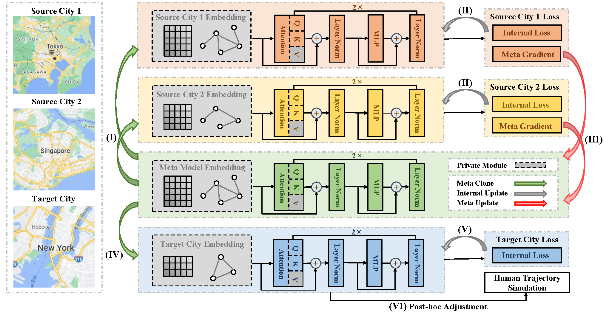

# COLA: Cross-city Mobility Transformer

The official PyTorch implementation of **COLA: Cross-city Mobility Transformer for Human Trajectory Simulation** (WWW '24). 

👉 Please consider giving this repository a star ⭐ if you find it helpful!



Check out our paper:
> COLA: Cross-city Mobility Transformer for Human Trajectory Simulation. <br/> *Yu Wang, Tongya Zheng†, Yuxuan Liang, Shunyu Liu, Mingli Song*. [[Link](https://arxiv.org/pdf/2403.01801.pdf)]

> **<p align="justify"> Abstract:** Human trajectory data produced by daily mobile devices has proven  its usefulness in various substantial fields such as urban planning  and epidemic prevention. In terms of the individual privacy concern,  human trajectory simulation has attracted increasing attention from  researchers, targeting at offering numerous realistic mobility data  for downstream tasks. Nevertheless, the prevalent issue of data  scarcity undoubtedly degrades the reliability of existing deep learn-  ing models. In this paper, we are motivated to explore the intriguing  problem of mobility transfer across cities, grasping the universal pat-  terns of human trajectories to augment the powerful Transformer  with external mobility data. There are two crucial challenges aris-  ing in the knowledge transfer across cities: 1) how to transfer the Transformer to adapt for domain heterogeneity; 2) how to calibrate  the Transformer to adapt for subtly different long-tail frequency distri-  butions of locations. To address these challenges, we have tailored a Cross-city mObiLity trAnsformer (COLA) with a dedicated model-  agnostic transfer framework by effectively transferring cross-city  knowledge for human trajectory simulation. Firstly, COLA divides  the Transformer into the private modules for city-specific character-  istics and the shared modules for city-universal mobility patterns. Secondly, COLA leverages a lightweight yet effective post-hoc ad-  justment strategy for trajectory simulation, without disturbing the  complex bi-level optimization of model-agnostic knowledge trans-  fer. Extensive experiments of COLA compared to state-of-the-art  single-city baselines and our implemented cross-city baselines have  demonstrated its superiority and effectiveness. The code is available  at https://github.com/Star607/Cross-city-Mobility-Transformer. </p>


## 📚 Citation

👉 If you find our work useful in your research, please consider citing 🌻:
```
@inproceedings{wang2024cola,
  title={COLA: Cross-city Mobility Transformer for Human Trajectory Simulation},
  author={Yu Wang, Tongya Zheng, Yuxuan Liang, Shunyu Liu, Mingli Song},
  journal={Proceedings of the ACM Web Conference},
  year={2024}
} 
``` 

## ⚙️ Installation

- Environment
    - Tested OS: Linux
    - Python >= 3.9
    - PyTorch == 1.10.2

- Dependencies
    - Install PyTorch 1.10.2 with the correct CUDA version.
    - Execute ``pip install -r requirements.txt`` command to install all of the Python modules and packages used in this project.

                        
## 🚀 Running

- Model Training
  - `python train.py`
  - `--train_cities` sets the source cities
  - `--data` sets the target city
  - `--datapath` refers to the path of data for each city
  - `--out_dir` is the file directory to save the trained model
  
- Trajectory Simulation
  - `python sample.py`
  - `--train_cities` sets the source cities
  - `--data` sets the target city
  - `--datapath` refers to the path of data for each city
  - `--out_dir` is the file directory to save the trained model and simulated trajectories

## 📃 Related Works

- [Spatiotemporal Gated Traffic Trajectory Simulation with Semantic-aware Graph Learning (Information Fusion 2024)](https://github.com/Star607/STEGA)                         


## 😊 Note

The implemention is based on *[nanoGPT](https://github.com/karpathy/nanoGPT)*.


